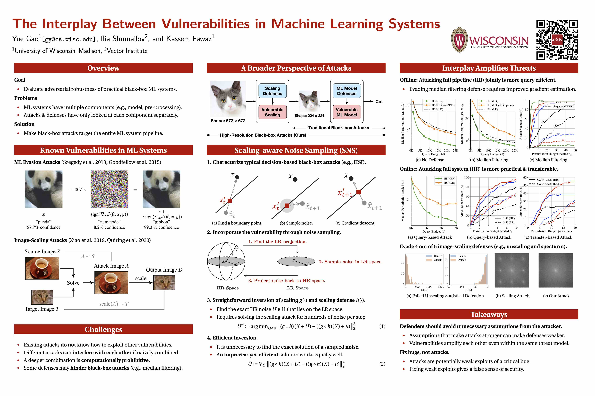

# Rethinking Image-Scaling Attacks

This repository is the official implementation of *Rethinking Image-Scaling Attacks: The Interplay Between Vulnerabilities in Machine Learning Systems*.

[[Paper](https://proceedings.mlr.press/v162/gao22g/gao22g.pdf)] [[Recorded Talk](https://slideslive.com/38983087)] [[Slides](https://icml.cc/media/icml-2022/Slides/16968_QVuMEKF.pdf)]

[](https://icml.cc/media/PosterPDFs/ICML%202022/01ded4259d101feb739b06c399e9cd9c_qTaoypQ.png)

## Requirements

### Environment

To setup environment:

```shell
conda create -n scaling python=3.10
conda activate scaling
conda install pytorch torchvision cudatoolkit=11.3 -c pytorch
pip install -r requirements.txt
```

### Datasets

To prepare ImageNet:

* Download the validation set from https://www.image-net.org
* Extract to `./static/datasets/imagenet/`

To prepare CelebA:

* Download the test set from https://mmlab.ie.cuhk.edu.hk/projects/CelebA.html
* Extract to `./static/datasets/celeba/`

### Models

To prepare models for ImageNet:

* The natural model will be downloaded automatically by Torch Vision.
* (Optionally) Download the robust ResNet-50 model `imagenet_l2_3_0.pt` from [GitHub Repo](https://github.com/MadryLab/robustness#pretrained-models).
* Save to `./static/models/`

To prepare models for CelebA:

* Download the pre-trained ResNet-34 model from [Google Drive](https://drive.google.com/file/d/13dIGRabkMBRt5CaWEkaUjhJD17VMPdQW/view?usp=sharing).
* Save to `./static/models/`

## Usage

### Select Images for Evaluation

To select ImageNet images larger than 672*672 that are correctly classified:

```shell
python -m scripts.select_images -d imagenet
```

To select CelebA images that are correctly classified:

```shell
python -m scripts.select_images -d celeba
```

### Evaluate black-box attacks on ImageNet

To preview all arguments:

```shell
python -m scripts.attack_blackbox --help
```

To run HSJ attack (LR) on ImageNet:

```shell
python -m scripts.attack_blackbox \
    --id 0 --dataset imagenet --model imagenet \
    --scale 1 --defense none \
    --attack hsj --query 25000 \
    --output static/logs --tag demo \
    --gpu 0
```

To run HSJ attack (HR) on ImageNet with median filtering defense:

```shell
python -m scripts.attack_blackbox \
    --id 0 --dataset imagenet --model imagenet \
    --scale 3 --defense median \
    --attack hsj --query 25000 \
    --output static/logs --tag demo \
    --gpu 0
```

To run HSJ attack (HR) on CelebA with no defense:

```shell
python -m scripts.attack_blackbox \
    --id 0 --dataset celeba --model celeba \
    --scale 3 --defense none \
    --attack hsj --query 25000 \
    --output static/logs --tag demo \
    --gpu 0
```

To run HSJ attack (HR) on Cloud API:

*Note: You need to set `TENCENT_ID` and `TENCENT_KEY` as environment variables to access the API.*

```shell
python -m scripts.attack_blackbox \
    --id 0 --dataset imagenet --model api \
    --scale 3 --defense none \
    --attack hsj --query 3000 \
    --output static/logs --tag demo \
    --gpu 0
```

To run ablation study, use the following flags:
* No SNS `--tag bad_noise --no-smart-noise`
* No improved median `--tag bad_noise -no-smart-median`
* No efficient SNS `--tag eq1 --precise-noise`

## Citation

If you find this work useful in your research, please cite our paper with the following BibTeX:

```bib
@inproceedings{gao2022rethinking,
  author    = {Yue Gao and Ilia Shumailov and Kassem Fawaz},
  editor    = {Kamalika Chaudhuri and Stefanie Jegelka and Le Song and Csaba Szepesv{\'{a}}ri and Gang Niu and Sivan Sabato},
  title     = {Rethinking Image-Scaling Attacks: The Interplay Between Vulnerabilities in Machine Learning Systems},
  booktitle = {International Conference on Machine Learning, {ICML} 2022, 17-23 July 2022, Baltimore, Maryland, {USA}},
  series    = {Proceedings of Machine Learning Research},
  volume    = {162},
  pages     = {7102--7121},
  publisher = {{PMLR}},
  year      = {2022},
  url       = {https://proceedings.mlr.press/v162/gao22g.html},
  biburl    = {https://dblp.org/rec/conf/icml/GaoSF22.bib},
  bibsource = {dblp computer science bibliography, https://dblp.org}
}
```

## Acknowledgements

* Pretrained Robust Models
  * https://github.com/MadryLab/robustness#pretrained-models
* Previous Image-Scaling Attack's Implementation
  * https://github.com/yfchen1994/scaling_camouflage
  * https://github.com/EQuiw/2019-scalingattack/tree/master/scaleatt
